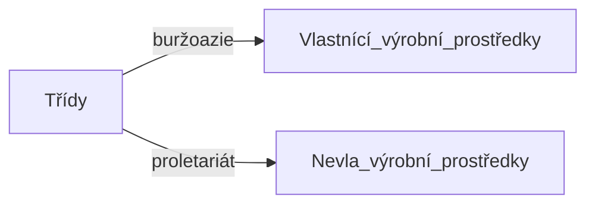

# Sociologie

## Karl Marx

- filosof, sociolog, ekonom
- => Komunistický manifest (1848), Kapitál (1867)
- sociální vztay => vztahy mezi třídami

- třídní boj, hodnota, nadhodnota

## Emil Durkheim

- francouzský sociolog
- **"otec moderní sociologie"**
	- sociologii institutizoval
- pozitivismus
- dělba práce, sebevražda, náboženství
- učil Edwarda Beneše

### Sociologie

- = věda o sociálních faktech
	- jsou vůči člověku vnější
	- vyvíjí na jedince tlak
	- každý čin konáme pod vlivem společnosti
	- => jazyk, právo, morálka, náboženství, móda
